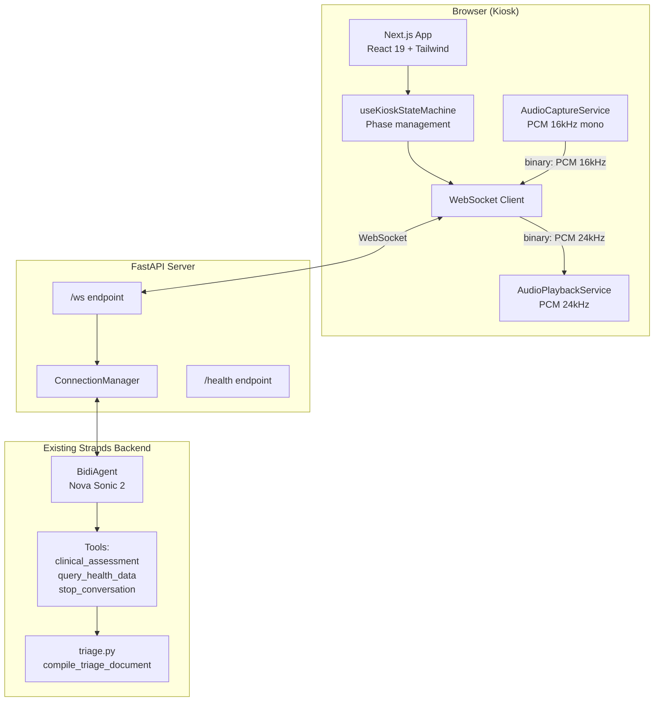
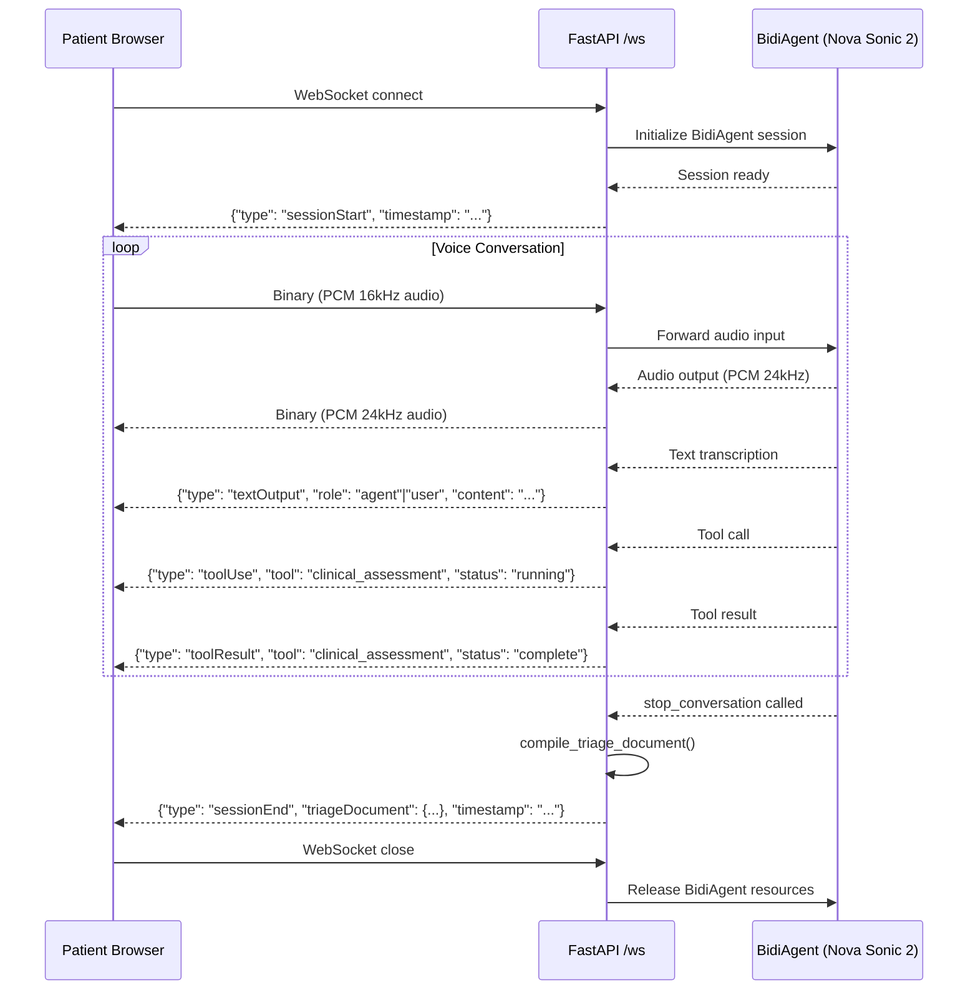

# Design Document — Patient Kiosk Frontend

## Overview

This design covers the patient-facing kiosk frontend for Triastral: a voice-first web application that guides emergency department patients through a 4-phase triage intake (welcome → conversation → validation → ticket). The system consists of two main parts:

1. **API Layer** — A FastAPI server with a WebSocket endpoint (`/ws`) that bridges the browser frontend to the existing Strands BidiAgent (Nova Sonic 2). It replaces the current PyAudio local I/O with a WebSocket-based audio transport.

2. **Frontend Application** — A Next.js 15 + React 19 application using Tailwind CSS, Framer Motion, and the Mistral color palette. It captures microphone audio (PCM 16kHz), streams it over WebSocket, receives agent audio (PCM 24kHz) for playback, and renders the 4-phase kiosk flow with an animated pixel art avatar.

The design draws from two legacy references:
- `legacy/old-frontend/patient-kiosk/` — UI components, state machine, types, Mistral theme
- `legacy/code-example/sample-nova-sonic-agentic-chatbot/` — FastAPI WebSocket pattern, audio capture/playback services, Nova Sonic event protocol

A critical constraint is the **information boundary**: CCMU levels, red flags, clinical assessments, and urgency indicators are never displayed to the patient. The frontend extracts only factual data (chief complaint, declared symptoms, history, medications, allergies) from the triage document for the validation screen.

## Architecture



### Data Flow



### Key Architectural Decisions

| Decision | Rationale |
|----------|-----------|
| FastAPI as API layer (not embedded in Next.js) | Keeps Python BidiAgent integration native; Next.js handles only UI |
| Binary WebSocket frames for audio | Avoids base64 overhead for high-frequency audio chunks (200ms intervals) |
| JSON WebSocket frames for events | Structured event protocol for text, tool use, session lifecycle |
| State machine hook (not Redux/Zustand) | Simple 4-phase linear flow; a hook with `useReducer` is sufficient |
| AudioWorklet for capture (ScriptProcessor fallback) | AudioWorklet runs off main thread for lower latency; ScriptProcessor for older browsers |
| Time-based scheduling for playback | Gapless audio playback by scheduling buffers ahead of `currentTime` |

## Components and Interfaces

### Backend — FastAPI API Layer

#### `backend/api/websocket.py` — WebSocket endpoint and ConnectionManager

```python
# ConnectionManager: one instance per WebSocket connection
class ConnectionManager:
    """Bridges a browser WebSocket to a BidiAgent session."""
    
    nova_client: BidiAgent          # Strands BidiAgent instance
    websocket: WebSocket            # FastAPI WebSocket
    is_active: bool
    
    async def connect(websocket: WebSocket) -> None
        """Accept WS, init BidiAgent with Nova Sonic 2 + tools."""
    
    async def disconnect() -> None
        """Stop BidiAgent session, release resources."""
    
    async def receive_audio(audio_data: bytes) -> None
        """Forward PCM 16kHz audio from browser to BidiAgent."""
    
    async def process_audio_output() -> None
        """Background task: read BidiAgent audio queue, send PCM 24kHz to browser."""
    
    async def process_events() -> None
        """Background task: read BidiAgent event queue, send JSON events to browser."""
    
    async def handle_tool_use(tool_name: str, tool_content: dict) -> dict
        """Execute tool and return result to BidiAgent."""
    
    async def handle_session_end() -> dict
        """Call compile_triage_document(), send sessionEnd event."""
```

#### `backend/api/routes.py` — HTTP endpoints

```python
@app.get("/health")
async def health() -> dict:
    """Returns {"status": "ok"}."""

@app.websocket("/ws")
async def websocket_endpoint(websocket: WebSocket) -> None:
    """Main WebSocket handler — delegates to ConnectionManager."""
```

### Frontend — Next.js Application

#### Component Tree

```
app/
├── layout.tsx                    # Root layout, font loading, Tailwind
├── page.tsx                      # Main kiosk page — renders current phase view
├── components/
│   ├── avatar/
│   │   └── PixelArtAvatar.tsx    # Animated pixel art avatar (5 states)
│   ├── SpeechBubble.tsx          # Message bubble with typewriter effect
│   ├── ProgressBar.tsx           # 4-phase progress indicator
│   ├── ErrorOverlay.tsx          # French error messages overlay
│   └── audio/
│       ├── AudioCaptureService.ts  # Mic capture → PCM 16kHz → WS binary
│       └── AudioPlaybackService.ts # WS binary → PCM 24kHz → AudioContext
├── views/
│   ├── WelcomeView.tsx           # Phase 1: greeting, consent, start button
│   ├── ConversationView.tsx      # Phase 2: avatar + speech bubbles + audio
│   ├── ValidationView.tsx        # Phase 3: factual summary, confirm/correct
│   └── TicketView.tsx            # Phase 4: QR code, reassurance, restart
├── hooks/
│   ├── useKioskStateMachine.ts   # Phase transitions + conversation state
│   └── useWebSocket.ts           # WebSocket connection + event dispatch
├── lib/
│   ├── eventProtocol.ts          # WS event type definitions + parsers
│   └── informationBoundary.ts    # Filter triage doc → patient-safe data
└── types/
    ├── kiosk.ts                  # KioskPhase, AvatarState, ConversationMessage
    ├── patient.ts                # PatientData, TriageDocument
    └── events.ts                 # WebSocket event types
```

#### `useKioskStateMachine` Hook

```typescript
type KioskPhase = 'welcome' | 'conversation' | 'validation' | 'ticket'
type AvatarState = 'idle' | 'waving' | 'talking' | 'listening' | 'happy'

interface KioskState {
  phase: KioskPhase
  avatarState: AvatarState
  messages: ConversationMessage[]
  triageDocument: TriageDocument | null
  patientSummary: PatientSummary | null  // filtered via information boundary
  isProcessing: boolean
  error: KioskError | null
}

type KioskAction =
  | { type: 'START_CONVERSATION' }
  | { type: 'AGENT_SPEAKING' }
  | { type: 'PATIENT_SPEAKING' }
  | { type: 'IDLE' }
  | { type: 'TOOL_RUNNING'; tool: string }
  | { type: 'TOOL_COMPLETE'; tool: string }
  | { type: 'ADD_MESSAGE'; message: ConversationMessage }
  | { type: 'SESSION_END'; triageDocument: TriageDocument }
  | { type: 'CONFIRM_VALIDATION' }
  | { type: 'CORRECT_INFO' }
  | { type: 'RESET' }
  | { type: 'SET_ERROR'; error: KioskError }
  | { type: 'CLEAR_ERROR' }

function kioskReducer(state: KioskState, action: KioskAction): KioskState
```

Phase transitions enforced by the reducer:
- `welcome` → `conversation` (on `START_CONVERSATION`)
- `conversation` → `validation` (on `SESSION_END`)
- `validation` → `ticket` (on `CONFIRM_VALIDATION`)
- `validation` → `conversation` (on `CORRECT_INFO`)
- `ticket` → `welcome` (on `RESET`)

#### `useWebSocket` Hook

```typescript
interface UseWebSocketReturn {
  isConnected: boolean
  connect: () => void
  disconnect: () => void
  sendAudio: (pcmData: ArrayBuffer) => void
  sendText: (content: string) => void
  onEvent: (handler: (event: WSEvent) => void) => void
}

function useWebSocket(url: string): UseWebSocketReturn
```

#### `AudioCaptureService`

```typescript
class AudioCaptureService {
  private mediaStream: MediaStream | null
  private audioContext: AudioContext | null
  private workletNode: AudioWorkletNode | null  // preferred
  private processorNode: ScriptProcessorNode | null  // fallback
  private rollingBuffer: RollingBuffer  // 3200 samples = 200ms at 16kHz

  async start(onChunk: (pcm: ArrayBuffer) => void): Promise<void>
  stop(): void
}
```

- Requests mic with `{ channelCount: 1, sampleRate: 16000, echoCancellation: true, noiseSuppression: true }`
- Converts Float32 → Int16 PCM
- Buffers into 3200-sample chunks (200ms) via `RollingBuffer`
- Calls `onChunk` with each filled buffer

#### `AudioPlaybackService`

```typescript
class AudioPlaybackService {
  private audioContext: AudioContext  // sampleRate: 24000
  private gainNode: GainNode
  private nextStartTime: number
  private scheduledBuffers: Set<AudioBufferSourceNode>

  playChunk(pcmData: ArrayBuffer): void
  stop(): void  // barge-in: cancel all scheduled buffers
  dispose(): void
}
```

- Decodes incoming binary as Int16 PCM → Float32
- Creates `AudioBuffer` at 24kHz, schedules via `source.start(nextStartTime)`
- `nextStartTime` advances by buffer duration for gapless playback
- `stop()` immediately cancels all scheduled sources (barge-in support)

#### `informationBoundary.ts`

```typescript
interface PatientSummary {
  chiefComplaint: string
  declaredSymptoms: string[]
  medicalHistory: string[]
  medications: string[]
  allergies: string[]
}

function extractPatientSummary(triageDocument: TriageDocument): PatientSummary
```

This function is the single point of enforcement for the information boundary. It extracts only factual, patient-declared data from the triage document. Fields like `recommended_ccmu`, `ccmu_reasoning`, `red_flags`, `clinical_assessment.opqrst`, and `is_urgent` are never accessed or returned.

## Data Models

### WebSocket Event Protocol

All JSON events include `type` and `timestamp` fields.

#### Server → Client Events

```typescript
// Session lifecycle
interface SessionStartEvent {
  type: 'sessionStart'
  timestamp: string  // ISO 8601
}

interface SessionEndEvent {
  type: 'sessionEnd'
  timestamp: string
  triageDocument: TriageDocument  // full document — frontend filters via information boundary
}

// Audio & text
interface AudioDataEvent {
  type: 'audioData'
  timestamp: string
  data: string  // base64-encoded PCM 24kHz (used only if binary frames unavailable)
}

interface TextOutputEvent {
  type: 'textOutput'
  timestamp: string
  role: 'agent' | 'user'
  content: string
}

// Tool execution
interface ToolUseEvent {
  type: 'toolUse'
  timestamp: string
  tool: string  // 'clinical_assessment' | 'query_health_data'
  status: 'running'
}

interface ToolResultEvent {
  type: 'toolResult'
  timestamp: string
  tool: string
  status: 'complete' | 'error'
}

// Error
interface ErrorEvent {
  type: 'error'
  timestamp: string
  message: string
}
```

#### Client → Server Events

```typescript
// Text input (JSON frame)
interface TextInputEvent {
  type: 'textInput'
  content: string
}

// Audio: sent as raw binary WebSocket frames (not JSON)
// PCM 16-bit mono, 16kHz, 3200 samples per chunk
```

### Triage Document (received from backend)

```typescript
interface TriageDocument {
  patient_chief_complaint: string
  clinical_assessment: {
    opqrst: Record<string, unknown>
    red_flags: string[]
    medical_history: string[]
    medications: string[]
    allergies: string[]
  }
  datagouv_context: Record<string, unknown>
  recommended_ccmu: string        // NEVER shown to patient
  ccmu_reasoning: string          // NEVER shown to patient
  data_quality_notes: string | null
  timestamp: string
}
```

### Kiosk Types

```typescript
type KioskPhase = 'welcome' | 'conversation' | 'validation' | 'ticket'

type AvatarState = 'idle' | 'waving' | 'talking' | 'listening' | 'happy'

interface ConversationMessage {
  id: string
  role: 'agent' | 'patient'
  text: string
  timestamp: number
}

interface KioskError {
  code: 'ws_disconnected' | 'ws_timeout' | 'mic_denied' | 'audio_error' | 'unknown'
  message: string  // French, non-technical
}

interface TicketData {
  qrToken: string
  arrivalTime: string  // ISO 8601
  patientSummary: PatientSummary
}
```

### Tailwind Theme Extension (Mistral Palette)

```javascript
// tailwind.config.ts
{
  theme: {
    extend: {
      colors: {
        mistral: {
          orange: '#FF7000',
          amber: '#FFB800',
          'orange-light': '#FF9E44',
          dark: '#0F172A',
          card: '#1E293B',
          'card-hover': '#334155',
        }
      },
      fontFamily: {
        sans: ['Inter', 'system-ui', 'sans-serif'],
      }
    }
  }
}
```

## Correctness Properties

*A property is a characteristic or behavior that should hold true across all valid executions of a system — essentially, a formal statement about what the system should do. Properties serve as the bridge between human-readable specifications and machine-verifiable correctness guarantees.*

### Property 1: State machine phase transitions are deterministic and correct

*For any* valid `(KioskPhase, KioskAction)` pair, applying the `kioskReducer` should produce exactly the expected next phase according to the transition table: `welcome→conversation` on `START_CONVERSATION`, `conversation→validation` on `SESSION_END`, `validation→ticket` on `CONFIRM_VALIDATION`, `validation→conversation` on `CORRECT_INFO`, `ticket→welcome` on `RESET`. Invalid transitions should leave the phase unchanged.

**Validates: Requirements 2.2, 2.3, 2.4, 2.5, 7.4**

### Property 2: Avatar state is correctly derived from kiosk actions

*For any* sequence of `KioskAction` dispatches, the resulting `avatarState` in the reducer output should match the expected mapping: `AGENT_SPEAKING→talking`, `PATIENT_SPEAKING→listening`, `IDLE→idle`, `TOOL_RUNNING→talking` (thinking animation), welcome phase→`waving`, ticket phase→`happy`. The avatar state should never be undefined.

**Validates: Requirements 5.2, 5.3, 5.4, 5.6, 5.7, 6.3, 8.4**

### Property 3: Information boundary — extractPatientSummary never leaks restricted fields

*For any* `TriageDocument` (including documents with arbitrary values in restricted fields), `extractPatientSummary` must return a `PatientSummary` containing only `chiefComplaint`, `declaredSymptoms`, `medicalHistory`, `medications`, and `allergies`. The output must never contain `recommended_ccmu`, `ccmu_reasoning`, `red_flags`, `opqrst`, or `is_urgent` as keys or values.

**Validates: Requirements 7.1, 7.2, 10.1, 10.2**

### Property 4: Server WebSocket events have valid type and timestamp

*For any* JSON event produced by the API layer, the event must contain a `type` field whose value is one of `{sessionStart, audioData, textOutput, toolUse, toolResult, sessionEnd, error}`, and a `timestamp` field that is a valid ISO 8601 string. Additionally, `textOutput` events must contain `role` and `content` fields, and `toolUse` events must contain `tool` and `status` fields.

**Validates: Requirements 1.5, 1.6, 12.1, 12.4, 12.5**

### Property 5: Float32-to-Int16 PCM conversion is reversible

*For any* Float32 audio sample in the range [-1.0, 1.0], converting to Int16 PCM and back to Float32 should produce a value within ±1/32768 of the original (quantization error bound). This validates the audio capture encoding and playback decoding are consistent inverses.

**Validates: Requirements 3.2, 4.1**

### Property 6: Audio chunking produces correct-size buffers

*For any* stream of PCM samples written to the `RollingBuffer`, every emitted chunk must be exactly 3200 samples (200ms at 16kHz). No partial chunks should be emitted during normal operation (only on flush at stream end).

**Validates: Requirements 3.3**

### Property 7: Audio playback scheduling is gapless

*For any* sequence of N audio buffers played through `AudioPlaybackService`, the start time of buffer[i+1] must equal the start time of buffer[i] plus the duration of buffer[i]. This ensures no gaps or overlaps in scheduled playback.

**Validates: Requirements 4.2**

### Property 8: Barge-in clears all scheduled audio

*For any* set of scheduled `AudioBufferSourceNode` instances in the `AudioPlaybackService`, calling `stop()` must result in an empty `scheduledBuffers` set and `isPlaying === false`. No previously scheduled audio should play after stop.

**Validates: Requirements 4.3**

### Property 9: Client text events serialize with required fields

*For any* text content string, serializing it as a client `textInput` event must produce valid JSON containing exactly `type: "textInput"` and a `content` field matching the input string.

**Validates: Requirements 12.3**

### Property 10: All error messages are French and non-technical

*For any* `KioskError` code in the set `{ws_disconnected, ws_timeout, mic_denied, audio_error, unknown}`, the corresponding error message string must be non-empty, contain at least one French character or word (validated against a French word list), and must not contain technical terms like "WebSocket", "AudioContext", "PCM", or stack traces.

**Validates: Requirements 11.4**

### Property 11: State machine reset produces clean initial state

*For any* `KioskState` (regardless of current phase, messages, errors, or triage document), dispatching `RESET` must produce a state identical to the initial state: `phase: 'welcome'`, `avatarState: 'idle'`, empty messages array, null triageDocument, null patientSummary, `isProcessing: false`, null error.

**Validates: Requirements 2.5, 8.5**

## Error Handling

### Frontend Error Handling

| Error Scenario | Detection | User-Facing Behavior |
|---|---|---|
| WebSocket disconnected during conversation | `onclose` / `onerror` event | Display `ErrorOverlay` with French message: "La connexion a été interrompue. Veuillez recommencer." + "Recommencer" button |
| Backend timeout (30s no response after connect) | `setTimeout` after `sessionStart` expected | Display: "Le service met trop de temps à répondre. Veuillez réessayer." + "Réessayer" button |
| Microphone access denied | `getUserMedia` rejection / `NotAllowedError` | Display: "L'accès au microphone est nécessaire pour la conversation. Veuillez autoriser l'accès au microphone dans les paramètres du navigateur." |
| Audio playback failure | `AudioContext` error / `decodeAudioData` failure | Display: "Un problème audio est survenu. Veuillez recommencer." |
| Unknown error | Catch-all | Display: "Une erreur inattendue s'est produite. Veuillez recommencer." |

All error messages are displayed via the `ErrorOverlay` component, which renders a semi-transparent overlay with the message and action button. The `KioskError` type maps error codes to French messages.

### Backend Error Handling

| Error Scenario | Detection | Behavior |
|---|---|---|
| BidiAgent session init failure | Exception in `connect()` | Send `{"type": "error", "message": "..."}` and close WebSocket |
| Tool execution failure | Exception in tool `@tool` function | Return fallback JSON with `suggested_ccmu: "3"` (cautious default, existing pattern) |
| WebSocket disconnect | `WebSocketDisconnect` exception | Cancel background tasks, release BidiAgent resources |
| Audio forwarding error | Exception in `receive_audio()` | Log error, continue (don't crash the session for a single bad chunk) |

### Reconnection Strategy

The kiosk does not attempt automatic WebSocket reconnection. On disconnect, the user is shown an error overlay with a "Recommencer" button that resets the state machine to `welcome` and starts a fresh session. This is appropriate for a kiosk context where each patient interaction is a discrete session.

## Testing Strategy

### Dual Testing Approach

The testing strategy uses both unit tests and property-based tests:

- **Unit tests** (pytest): Specific examples, edge cases, integration points, error conditions
- **Property-based tests** (hypothesis): Universal properties across randomly generated inputs

### Property-Based Testing Configuration

- **Library**: `hypothesis` (Python backend) + `fast-check` (TypeScript frontend)
- **Minimum iterations**: 100 per property test
- **Each test tagged**: `# Feature: patient-kiosk-frontend, Property {N}: {title}`

### Frontend Tests (fast-check + vitest)

| Property | Test Description | Min Iterations |
|---|---|---|
| Property 1 | Generate random (phase, action) pairs → verify reducer output phase | 100 |
| Property 2 | Generate random action sequences → verify avatar state mapping | 100 |
| Property 3 | Generate random TriageDocument objects with arbitrary restricted field values → verify extractPatientSummary excludes them | 100 |
| Property 5 | Generate random Float32 samples in [-1, 1] → convert to Int16 → convert back → check error bound | 100 |
| Property 6 | Generate random-length sample arrays → write to RollingBuffer → verify all emitted chunks are 3200 samples | 100 |
| Property 7 | Generate random sequences of buffer durations → verify start times are contiguous | 100 |
| Property 8 | Generate random sets of scheduled buffers → call stop() → verify empty set | 100 |
| Property 9 | Generate random strings → serialize as textInput → verify JSON structure | 100 |
| Property 10 | Iterate all error codes → verify French message, no technical terms | 100 |
| Property 11 | Generate random KioskState objects → dispatch RESET → verify clean initial state | 100 |

### Backend Tests (hypothesis + pytest)

| Property | Test Description | Min Iterations |
|---|---|---|
| Property 4 | Generate random event dicts → pass through event formatter → verify type and timestamp fields | 100 |

### Unit Tests (Examples & Edge Cases)

| Test | Type | Description |
|---|---|---|
| WebSocket /ws accepts connection | example | Connect to /ws, verify sessionStart event received |
| GET /health returns ok | example | HTTP GET /health → 200 + `{"status": "ok"}` |
| Welcome screen renders in French | example | Render WelcomeView → verify "Triastral", "Commencer", consent text present |
| Validation screen shows confirm/correct buttons | example | Render ValidationView → verify "Confirmer" and "Corriger" buttons |
| Ticket screen shows QR code | example | Render TicketView with ticket data → verify QR code element rendered |
| Mic denied shows French error | example | Simulate getUserMedia rejection → verify error overlay with French message |
| WS disconnect shows error overlay | example | Simulate WebSocket close during conversation → verify error overlay |
| 30s timeout shows timeout message | example | Simulate no sessionStart within 30s → verify timeout error |
| Empty triage document handled | edge case | extractPatientSummary with empty/missing fields → returns empty PatientSummary |
| Triage document with extra unknown fields | edge case | extractPatientSummary ignores unknown fields |
| Audio capture cleanup on phase exit | example | Start capture in conversation → transition to validation → verify mediaStream released |
| Audio playback cleanup on phase exit | example | Playing audio → transition to validation → verify AudioContext closed |
